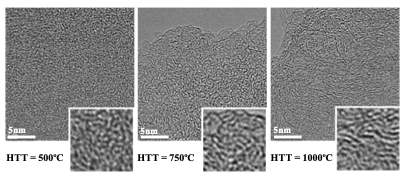

# Building Biochar Molecular Models from Scratch
### The Iterative Approach

*Tutorial written by Valentina Erastova (valentina.erastova@ed.ac.uk), University of Edinburgh, in June 2026*

*Based on Wood, Mašek & Erastova (CRPS, 2024) and Ngambia, Mašek & Erastova (BiomBioe, 2024)*

---

## What this tutorial is about

This tutorial covers how to build the biochar model. If you already have a biochar model and want to use it for adsorption studies, please refer to the following "Setting Up Biochar Adsorption Simulations in GROMACS" tutorial instead.

In this tutorial, you will learn how to go from experimental measurements of a real biochar material to a validated, GROMACS simulation-ready molecular structure representative of the experimental biochar.

This is the approach introduced by Wood, Mašek & Erastova in their two-part Cell Reports Physical Science study (2024, [10.1016/j.xcrp.2024.102036](doi.org/10.1016/j.xcrp.2024.102036), [10.1016/j.xcrp.2024.102037](doi.org/10.1016/j.xcrp.2024.102037)) and extended to microporous biochars by Ngambia, Mašek & Erastova (Biomass and Bioenergy, 2024, [10.1016/j.biombioe.2024.107199](doi.org/10.1016/j.biombioe.2024.107199)). The process is *iterative* - you will go around a loop several times before the model is good enough. That is normal and expected. The iterative loop is the method. 

By the end, you will have a bulk biochar structure — periodic, equilibrated, and validated against experiment — ready to have its surface exposed for adsorption studies.

---

## The big picture before you start

![The iterative biochar model-building workflow (Ngambia, Mašek & Erastova, 2024). Target experimental properties (left) divide into chemical descriptors — used to select building blocks — and physical descriptors — used to validate the condensed model. Molecular building blocks (polycyclic aromatics, shown in grey) and virtual atoms (orange and green spheres, for pore control) are packed into a large simulation box (System Assembly, top right), then condensed by simulated annealing into a bulk solid (Condensation, bottom right). The condensed model is tested against experimental targets: if physical properties match the targets, it proceeds to Applications; if not, the building block select —ion is updated and the loop repeats.](Schema1.png)

*Figure 1. The iterative protocol for biochar molecular model development (reproduced from Ngambia, Mašek & Erastova, Biomass and Bioenergy, 2024). This schematic is the map for everything that follows in this tutorial.*

---

Classical molecular dynamics (MD) cannot simulate pyrolysis. The bonds are defined by a force field and are fixed; nothing can react. So you cannot start from cellulose and cook it up. Instead, you work backwards: you use the experimental measurements that describe the *product* (the biochar) to constrain an assembly of pre-drawn molecules that collectively reproduce those measurements. The simulation does not tell you what chemistry happened during pyrolysis. It tells you what a material with these particular molecular properties looks like when packed into a solid — and whether that solid matches the experimental target.

Looking at Figure 1, you can see the whole process laid out. On the left is the experimental data that defines what you are trying to build. In the centre are the two types of ingredients: **molecular building blocks** (the polycyclic aromatic molecules you draw) and **virtual atoms** (the large, soft massless spheres used to define pore space). These are packed into a large, low-density simulation box (top right — the grey molecules scattered loosely with orange virtual atom spheres), then condensed by simulated annealing into a compact solid (bottom right — the same material after condensation, now dense and continuous, with virtual atoms still embedded). The resulting condensed model is then tested against the target properties. If it passes, it goes on to applications — which for us means exposing the surface and running adsorption simulations. If it fails, you update your building block selection and go around again.

This means there is a strict division of labour between two types of properties, and understanding it is essential before you start.

**Chemical descriptors** — H/C ratio, O/C ratio, aromaticity index, aromatic domain size, functional group types. These are set by the atomic content of your molecules and are fixed by your choice of building blocks. They will not change during the simulation. Use them to make your initial selection.

**Physical descriptors** — true density, cumulative pore volume, pore size distribution. These *emerge* from how your molecules pack together during condensation. You cannot control them directly. They are what the simulation returns. Compare them to experiment after each condensation, and use the comparison to revise your building block selection. 
The iterative loop is therefore: choose building blocks → pack → condense → check physical properties → adjust building blocks → repeat.

---

## Phase 1: Define your target

### 1.1 Collect experimental data

Before drawing a single building block molecule, you need to know what you are trying to reproduce. The minimum set of properties required is:

- **H/C molar ratio** — from elemental analysis
- **O/C molar ratio** — from elemental analysis
- **Aromaticity index** — fraction of aromatic carbons, from solid-state ¹³C NMR (the ratio of the aromatic peak at ~130 ppm to the total carbon signal)
- **True density** — from helium pycnometry, in kg m⁻³
- **Functional groups present** — qualitative, from FTIR and/or XPS (which groups are present at your HTT: carboxyl, carbonyl, phenol, ether, quinone, pyrone?)

If you are building a model with porosity targets, you also need:
- **Cumulative micropore volume** — from CO₂ and/or N₂ adsorption (DFT/NLDFT analysis), in cm³ g⁻¹
- **Pore size distribution** — the range and peak of pore radii, in nm

Other additional descriptors - such as morphology from HR-TEM, aromatic domain-size distribution, swelling and mechanical properties — are beneficial to help refine your model.

If you are characterising a specific biochar in your own lab, use your own measurements. If you are trying to model a general class of woody biochars at a given Highest Treatment Temperature (HTT), you can use the database collated by Wood et al., which is freely available at [github.com/Erastova-group/Biochar_MolecularModels](https://github.com/Erastova-group/Biochar_MolecularModels) under `exper_data/`. This brings together data from over 300+ published samples across the UKBRC Charchive, UC Davis Biochar Database and literature.

### 1.2 Fit the experimental data to extract target values

If you have your own single-sample data, use it directly — with the caveat that it represents one measurement of an inherently variable material. If you have multiple measurments, it is better as gives us a confidence interval. If you are using the literature database, fit a sigmoidal curve to obtain a mean and confidence interval at your chosen HTT. Wood et al. used `scipy.optimize.curve_fit` with:

```
y = L / (1 + exp(-k(x - x0))) + b
```

where x is HTT and y is the property value. This gives you the curve shape from the mean data; then fix k and x₀ and refit to the lower and upper quantiles to get confidence bounds.

The result is a table like this — your target for the modelling:

| Property | HTT 400 °C | HTT 600 °C | HTT 800 °C |
|---|---|---|---|
| H/C | 0.65 (0.49–0.82) | 0.23 (0.08–0.36) | 0.12 (0.00–0.24) |
| O/C | 0.21 (0.15–0.29) | 0.07 (0.02–0.15) | 0.05 (0.00–0.12) |
| Aromaticity index (%) | 75 (70–81) | 96 (92–99) | 99 (96–100) |
| True density (kg m⁻³) | 1430 (1380–1490) | 1540 (1490–1600) | 1850 (1800–1900) |

The confidence intervals are your friends. They define how much chemical space you have to explore. A wide interval means you have flexibility; a narrow one means you need to be precise.

Keep this table open — you will refer back to it constantly.

---

## Phase 2: Design your building blocks

### 2.1 What a building block is

A building block in this context is a single polycyclic aromatic molecule — drawn by hand — that represents one "unit" of the biochar structure. Real biochars are not made of identical repeating units, but the solid formed by a collection of chemically diverse building blocks can reproduce the bulk properties of the material very well.

Each building block has three components:

**The aromatic core** — a fused ring system, all or mostly hexagonal, making up the bulk of the carbon. The size of the core (number of rings) is the most important parameter for controlling true density. Larger cores → higher density. This relationship is approximately logarithmic: density scales as ~log(aromatic domain size in rings). You will use this to tune density.

**Arm groups** — attached to the core's edges. Alkyl (sp³) arms increase H/C ratio and decrease aromaticity index. Aryl (sp²) arms increase H/C without reducing aromaticity. Adjust their length and number to hit your target H/C and aromaticity index.

**Oxygen-containing functional groups** — attached at edge positions. These control O/C ratio and determine what surface chemistry is available for adsorption. The type depends on HTT:

- Low-HTT biochars (400 °C), O/C=0.2–0.4: carboxyl (–COOH), phenol (–OH), carbonyl (–C=O), ester (–COO–), ether (–C–O–C–)
- Medium-HTT biochars (600 °C), O/C=0.1–0.2: carbonyl, ether, phenol (fewer and more stable groups)
- High-HTT biochars (800 °C), O/C=0.02–0.1: quinone, pyrone (only the most thermally stable groups survive)

**Heteroatoms** — depending on the starting material and treatments, some heteroatoms other than O can be present in smaller quantities. Those are, namely, nitrogen (N/C=0.005–0.05, woody BCs <0.01; protein/manure/sludge—rich BCs >0.04), sulphur (S/C=0.0001–0.005, plant BCs <0.001; present sewage sludge BCs) and phosphorus (P/C=0.001–0.03, plant BC <0.002; high in animal-related BCs). Their positioning and configurations are strictly governed by HTT:

- N: At low HTT (<500 °C), these are edge-bound as pyridinic or pyrrolic groups. Above 600 °C, aromatic sheets expand, and N becomes embedded within the inner lattice as stable graphitic (quaternary) N.
- S: At low/medium HTT, its large atomic radius limits it to edge positions as thiols (–SH), sulfoxides (–S=O), or sulfonic acids(–SO3H). Above 700 °C, it bridges edges or forces its way into the lattice as thiophene-like structures, creating highly reactive defects.
- P: At low HTT, it binds with oxygen as protruding edge-bound phosphate (C–O–P) or phosphonate (C–P=O) groups. Above 700 °C, it incorporates into the inner lattice, forcing the carbon sheets to buckle out-of-plane and altering pore structure.

In this tutorial example, we will not include any heteroatoms beyond O.


**Non-hexagonal rings** — pentagonal (5-membered) and heptagonal (7-membered) rings introduce curvature into what would otherwise be flat graphitic sheets. Use approximately one pentagonal ring per five hexagonal rings and one heptagonal ring per ten. This breaks the tendency to form perfectly stacked crystallites and produces the amorphous morphology seen in HR-TEM images of real biochars, particularly at low-to-medium HTT. The trade-off is that curved structures pack less efficiently, so they will lower true density — something to keep in mind for the iteration.

### 2.2 Drawing building blocks in MarvinSketch

MarvinSketch (ChemAxon, free for academic use) is the recommended tool. Draw the structure you want, then export it as a `.mol` file. A few practical rules:

- Cap every edge carbon with a hydrogen — do not leave radicals
- Be explicit about protonation states (carboxylic acid = –COOH, not –COO⁻, for a neutral molecule)
- Keep the structure as a single connected molecule; do not draw fragments
- Save with a descriptive name that encodes its key properties, e.g. `BC600_core75rings_phenol_ether.mol`

Open `building_blocks/` in the Biochar_MolecularModels repository to see how the deposited building blocks are named and structured. The `building_blocks.csv` file in that directory records the chemical descriptors for each one — read this before drawing your own, as you may find a suitable structure is already available.

### 2.3 Calculate descriptors

Once you have a `.mol` file, you need to calculate its properties. For many blocks, it is simplest to use RDKit in Python. This ensures you know exactly what you are putting into the simulation:

```python
from rdkit import Chem
from rdkit.Chem import Descriptors, rdMolDescriptors

mol = Chem.MolFromMolFile('my_building_block.mol')

# Atom counts
num_C = sum(1 for a in mol.GetAtoms() if a.GetAtomicNum() == 6)
num_H = sum(1 for a in mol.GetAtoms() if a.GetAtomicNum() == 1)
num_O = sum(1 for a in mol.GetAtoms() if a.GetAtomicNum() == 8)

HC_ratio = num_H / num_C
OC_ratio = num_O / num_C

# Aromaticity index
num_arom_C = sum(1 for a in mol.GetAtoms()
                  if a.GetAtomicNum() == 6 and a.GetIsAromatic())
aromaticity_index = num_arom_C / num_C * 100

# Aromatic domain size (number of aromatic rings)
ring_info = mol.GetRingInfo()
arom_rings = sum(1 for ring in ring_info.AtomRings()
                  if all(mol.GetAtomWithIdx(i).GetIsAromatic() for i in ring))

print(f"H/C = {HC_ratio:.2f}, O/C = {OC_ratio:.2f}, "
      f"Aromaticity = {aromaticity_index:.0f}%, "
      f"Aromatic rings = {arom_rings}")
```

Check these against your target. Note that a single building block does not need to exactly match the target — the system is a *mixture* of building blocks, and the mixture average is what needs to match.

### 2.4 Assign force field parameters

Each building block needs to be assigned force field parameters before the simulation. We choose to use OPLS-AA, as a common, well-tested and reliable force field. The assignment of a force field is a complex task, LigParGen ([zarbi.chem.yale.edu/ligpargen](http://zarbi.chem.yale.edu/ligpargen)) does this automatically for most organic structures. Upload your `.mol` file, select OPLS-AA as the force field, and download the output as GROMACS format (`.gro` + `.itp` files).

For larger or more unusual structures, PolyParGen ([polypargen.com](http://polypargen.com)) handles polymeric and extended aromatic systems that exceed LigParGen's limits.

After downloading the assigned structures and force field files:
1. Run a brief energy minimisation on the single molecule to resolve any internal strain from the 2D → 3D coordinate conversion (use `gmx editconf`, ensure that your simulation box is 2x the cut-off and run minimisation with the standard steepest-descent protocol)
2. Check the output structure in VMD (or your preferred visualisation software) — it should look chemically sensible

If the molecule comes out badly distorted after minimisation, the topology may have an incorrect dihedral or angle parameter. Re-examine the structure in MarvinSketch and check that bond orders are drawn correctly, then re-upload.

---

## Phase 3: Pack the simulation box

### 3.1 Choose your building block mixture

You need to select both which building blocks to include and how many copies of each. This is your "best guess" starting point. The goal is a mixture whose average H/C, O/C, and aromaticity index matches your target.

Calculate the mixture-averaged properties for a trial composition. For a box containing $n_i$ copies of building block $i$ with properties (H/C)$_i$, (O/C)$_i$, and aromaticity index $A_i$:

```python
import numpy as np

# Example: 3 building blocks, 10 copies each
n = np.array([10, 10, 10])             # copies of each block
HC = np.array([0.65, 0.55, 0.75])     # H/C of each
OC = np.array([0.18, 0.22, 0.20])     # O/C of each
AI = np.array([78, 76, 74])           # aromaticity index of each

# Total atoms of each element across the mixture
C_tot = np.array([n_C_1, n_C_2, n_C_3])  # from RDKit for each block
H_tot = C_tot * HC
O_tot = C_tot * OC

HC_mixture = H_tot.sum() / C_tot.sum()
OC_mixture = O_tot.sum() / C_tot.sum()
AI_mixture = (AI * C_tot * n).sum() / (C_tot * n).sum()

print(f"Mixture: H/C={HC_mixture:.2f}, O/C={OC_mixture:.2f}, AI={AI_mixture:.0f}%")
```

Adjust ratios until the mixture average falls within your target confidence interval.

**On system size**: aim for roughly 10,000–15,000 atoms in the bulk model. Too small and the system will show large variance between replicas; too large and the condensation becomes too computationally expensive. The published BC400 model contains ~14,560 C atoms plus H and O, representing a box of roughly 6.5 × 6.5 × 6.5 nm after condensation.

### 3.2 Pack molecules into a box 

Start with a large, low-density simulation box — roughly 5–10× larger than the expected final volume. This gives molecules room to move during the initial high-temperature phase of annealing. You can use `gmx insert-molecules` to help you pack this box:

```bash
# Create an empty box (in nm) - start big
gmx editconf -f first_building_block.gro -o box.gro -box 15 15 15 -c

# Insert copies of each building block
gmx insert-molecules -f box.gro -ci block1.gro -nmol 20 -o box_with_b1.gro
gmx insert-molecules -f box_with_b1.gro -ci block2.gro -nmol 20 -o box_with_b1b2.gro
gmx insert-molecules -f box_with_b1b2.gro -ci block3.gro -nmol 20 -o initial_box.gro
```
Make sure that the desired number of. molecules have been inserted; if not, use the `-try 500` flag or increase box size.

If you are making a porous model (see Phase 5), add virtual atoms at this stage (see below) before condensing.

Update your topology file (`biochar.top`) to include all molecule types and their counts in the `[ molecules ]` section:

```
[ molecules ]
; molecule name    number
BB1               20
BB2               20
BB3               20
```

Energy-minimise before annealing:

```bash
gmx grompp -f em.mdp -c initial_box.gro -p biochar.top -o em.tpr
gmx mdrun -deffnm em -v
```

---

## Phase 4: Simulated annealing condensation

This is the core of the model-building step. The system starts hot and spread out, then cools while being compressed under pressure until it forms a compact solid. The temperature sequence and pressure are critical — here are the parameters used in the published works, which we recommend that you replicate.

### 4.1 Step 1: NVT high-temperature equilibration (10 ns)

Before applying pressure, let the molecules move freely at high temperature to sample configuration space. The temperature depends on HTT:
| Target biochar | NVT temperature | Timestep |
|---|---|---|
| 400 °C | 1000 K | 1 fs |
| 600 °C | 2000 K | 0.5 fs |
| 800 °C | 3000 K | 0.5 fs |

Higher-temperature biochars need higher annealing temperatures because their larger, more rigid aromatic domains require more thermal energy to explore configuration space before condensing at lower temperatures. The timestep is dependent on the fast motions (bond vibration) and so needs to be reduced for the high temperature simulations.

The mdp file for this step:

```ini
; nvt_hot.mdp — High-temperature NVT equilibration
integrator      = md
nsteps          = 10000000     ; 10 ns (at dt=0.001 fs for BC400)
dt              = 0.001        ; 1 fs for BC400; 0.0005 for BC600/BC800
nstxout         = 10000
nstvout         = 10000
nstenergy       = 1000
nstlog          = 1000

; Temperature
tcoupl          = V-rescale
tc-grps         = System
tau-t           = 0.1
ref-t           = 1000         ; change to 2000 or 3000 for BC600/BC800

; No pressure coupling
pcoupl          = no

; Non-bonded
cutoff-scheme   = Verlet
coulombtype     = PME
rcoulomb        = 1.2
rvdw            = 1.2
pbc             = xyz

; Constraints
constraints     = h-bonds
constraint-algorithm = lincs
```

### 4.2 Step 2: NPT simulated annealing with cooling (25 ns)

Now apply pressure and cool the system in a controlled ramp. GROMACS supports annealing schedules natively through the `annealing` keywords in the mdp file:

```ini
; npt_anneal.mdp — NPT simulated annealing
integrator      = md
nsteps          = 25000000     ; 25 ns
dt              = 0.001        ; 1 fs (BC400); 0.0005 (BC600/BC800)

; Temperature — annealing schedule
tcoupl          = V-rescale
tc-grps         = System
tau-t           = 0.1
ref-t           = 1000         


; Annealing: hold at high T for 10 ns, then ramp to 300 K by 20 ns, hold
annealing       = single
annealing-npoints = 4
; Time points (ps):        0      10000   20000   25000
annealing-time    = 0 10000 20000 25000
; Temperatures (K):
annealing-temp    = 1000 1000 300 300
; For BC600: 2000 2000 300 300
; For BC800: 3000 3000 300 300

; Pressure — isotropic (bulk condensation)
pcoupl          = Berendsen
pcoupltype      = isotropic
tau-p           = 1.0
ref-p           = 1000.0       ; 1000 bar — high pressure to drive condensation
compressibility = 4.5e-5

; Non-bonded
cutoff-scheme   = Verlet
coulombtype     = PME
rcoulomb        = 1.2
rvdw            = 1.2
pbc             = xyz

; Constraints
constraints     = h-bonds
constraint-algorithm = lincs
```

The high pressure (1000 bar) is intentional. It drives rapid contraction of the simulation box, preventing the building blocks from forming isolated clusters instead of a continuous solid. Without it, you often get fragmented grain structures and large voids — not representative of the bulk material.

In the above example, we use isotropic pressure scaling. This will produce an equivalent-sided cube, but it may artificially force uniform stress across all directions and prevent the formation of ordered domains. If independent directional relaxation is needed, anisotropic pressure coupling with fixed box angles at 90° can be used: 

```ini
; Pressure — anisotropic (Independent x,y,z contraction; fixed 90 deg angles)
pcoupl          = Berendsen
pcoupltype      = anisotropic
tau-p           = 1.0    1.0    1.0    1.0    1.0    1.0
ref-p           = 1000.0 1000.0 1000.0 0.0    0.0    0.0
compressibility = 4.5e-5 4.5e-5 4.5e-5 0.0    0.0    0.0
```

Since the publication of our articles, GROMACS introduced the stochastic cell-rescaling, `C-rescale`, barostat which behaves exactly like Berendsen in terms of speed, robustness, and stability, but it fixes Berendsen's flaw and samples the correct thermodynamic ensemble (NPT). We recommend using that instead.

```ini
; Pressure — anisotropic (Using c-rescale for correct ensemble)
pcoupl          = c-rescale
pcoupltype      = anisotropic
tau-p           = 1.0    1.0    1.0    1.0    1.0    1.0
ref-p           = 1000.0 1000.0 1000.0 0.0    0.0    0.0
compressibility = 4.5e-5 4.5e-5 4.5e-5 0.0    0.0    0.0
```

Watch the system density in the `npt_anneal.edr` file using `gmx energy`. It should increase steadily as the box contracts and the material condenses:

```bash
gmx energy -f npt_anneal.edr -o density_annealing.xvg
# Select "Density" from the menu
```

Plot it. A monotonic increase that plateaus is what you want. If the density oscillates wildly or the simulation crashes, check for clashes or unreasonably short bond lengths in the initial structure.


### 4.3 Step 3: NPT room-temperature equilibration (10 ns)

After annealing, equilibrate at atmospheric conditions:

```ini
; npt_eq.mdp — Room-temperature equilibration
integrator      = md
nsteps          = 10000000     ; 20 ns
dt              = 0.002        ; 2 fs (system is now compact, stable, standard cond)

tcoupl          = V-rescale
tc-grps         = System
tau-t           = 0.1
ref-t           = 300

pcoupl          = c-rescale ; previously Berendsen
pcoupltype      = isotropic
tau-p           = 1.0
ref-p           = 1.0          ; back to 1 bar
compressibility = 4.5e-5

cutoff-scheme   = Verlet
coulombtype     = PME
rcoulomb        = 1.4
rvdw            = 1.4
pbc             = xyz
constraints     = h-bonds
```

At this stage, the box dimensions should have stabilised. This is your bulk model candidate.

We strongly recommend to **run at least three independent replicas** using different initial random placements of the building blocks. The annealing outcome is sensitive to the starting configuration — three replicas let you assess reproducibility and report a mean ± standard deviation for the density, which is required for validation.


---

## Phase 5 (optional): Adding controlled microporosity with virtual atoms

The basic iterative approach produces models with some *intrinsic* microporosity from imperfect packing, but it does not let you control pore sizes precisely. If your target biochar has experimentally measured pore volumes and size distributions, you need virtual atoms (VAs).

### What VAs are

VAs are massless "dummy" atoms that interact with real atoms through a soft, purely repulsive Lennard-Jones potential. During condensation, they act like the volatile gases escaping from the pyrolysing biomass — they push the condensing carbon matrix outward, carving cavities that persist after the VAs are removed.

The pore size they create depends on two Lennard-Jones parameters: $\sigma$ (the size parameter, related to pore diameter) and $\epsilon$ (the depth of the well, which controls how soft/hard the repulsion is). Ngambia et al. characterised this relationship systematically by testing VAs in simple hydrocarbons. A practical reference table:

| VA name | $\sigma$ (nm) | $\epsilon$ (kJ mol⁻¹) | Mean pore radius (nm) | Pore volume (nm³) |
|---|---|---|---|---|
| V10-9 | 1.0 | 10⁻⁹ | 0.24 ± 0.21 | 0.17 ± 0.36 |
| V10-6 | 1.0 | 10⁻⁶ | 0.35 ± 0.09 | 0.21 ± 0.18 |
| V22-6 | 2.2 | 10⁻⁶ | 0.53 ± 0.06 | 0.65 ± 0.27 |
| V30-6 | 3.0 | 10⁻⁶ | 0.62 ± 0.05 | 1.00 ± 0.23 |
| V45-6 | 4.5 | 10⁻⁶ | 0.78 ± 0.05 | 1.97 ± 0.39 |

For woody biochars at 600–650 °C, the experimental cumulative micropore volume is ~0.12–0.18 cm³ g⁻¹. The two VAs used in the published porous models are V10-6 (for smaller pores, ~0.35 nm radius) and V30-6 (for larger micropores, ~0.62 nm radius).

### How to add VAs to your system

**Step 1: Define the VA in your force field.** Add the following to your `oplsaa.ff/ffnonbonded.itp`:

```
; Virtual atom parameters
; name   at.num  mass   charge  ptype  sigma(nm)  epsilon(kJ/mol)
VA10     0       0.0    0.0     A      1.0        1e-6
VA30     0       0.0    0.0     A      3.0        1e-6
```

Using the OPLS geometric combination rules ($\sigma_{ij} = \sqrt{\sigma_i × \sigma_j}$, $\epsilon_{ij} = \sqrt{\epsilon_i × \epsilon_j}$), the combined interaction between a VA and a typical aromatic carbon (OPLS $\sigma_C$ = 0.355 nm, $\epsilon_C$ = 0.293 kJ mol⁻¹) will be soft and repulsive, as required.

**Step 2: Create VA coordinate files.** A VA is a single-atom "molecule":

```
; va10.gro — single virtual atom
VA10
    1
    1VA10   VA10    1   0.000   0.000   0.000
   1.00000   1.00000   1.00000
```

Create a corresponding topology `va10.itp`:

```
[ moleculetype ]
; name  nrexcl
VA10     1

[ atoms ]
; nr  type  resnr  residue  atom  cgnr  charge  mass
  1   VA10    1     VA10    VA10    1     0.0    0.0
```

**Step 3: Calculate how many VAs to add.** From the target cumulative pore volume and the per-VA pore volume (Table above), calculate the number of VAs needed. For a system targeting 0.15 cm³ g⁻¹ with V30-6 (1.00 nm³ each), and a system containing ~2,000 carbon atoms (mass ~24,000 g mol⁻¹, or ~4×10⁻²⁰ g per simulation box):

```python
target_pore_vol_per_g = 0.15e-21  # cm3/g 

# estimate total pore volume for the simulation box
system_mass_g = total_atoms_mass / 6.022e23  # in grams
target_pore_vol_nm3 = target_pore_vol_per_g * system_mass_g * 1e21  # nm3

pore_vol_per_VA = 1.00  # nm3 for V30-6
n_VA = int(target_pore_vol_nm3 / pore_vol_per_VA)

print(f"Add {n_VA} VA30 virtual atoms")

```

**Step 4: Insert VAs into the pre-condensation box.** Add them alongside the building blocks before annealing (Phase 3 above):

```bash
gmx insert-molecules -f box_with_building_blocks.gro -ci va10.gro -nmol 231 -o box_with_VA.gro

```

Add `VA10  231` (or the relevant count) to the `[ molecules ]` section of your topology.

**Step 5: Run condensation as normal.** The VAs will be displaced by the condensing matrix and end up occupying defined cavities in the final structure. They do not change the annealing protocol.

**Step 6: Remove the VAs.** After the room-temperature equilibration, the VAs must be extracted from the structure before validation and further application of the model. This requires editing both the `.gro` and `.top` files to remove all VA entries. A simple Python approach:

```python
# Remove VA lines from .gro file

with open('npt_eq.gro', 'r') as f:
    lines = f.readlines()

filtered = [l for l in lines if 'VA10' not in l and 'VA30' not in l]

# Update atom count (line 2 of .gro)

n_atoms_new = int(filtered[1].strip()) - n_VA_total
filtered[1] = f'{n_atoms_new}\n'

with open('biochar_no_VA.gro', 'w') as f:
    f.writelines(filtered)
```

Also remove the VA `[ moleculetype ]` include and count from the topology. 

Then run a brief energy minimisation on the VA-free structure — removing atoms leaves small voids where interactions were not sampled, and minimisation resolves these cleanly. 

Not every porous biochar structure is stable. The next step is to run another room-temperature equilibration step - did your biochar remain stable? If the system collapsed, you used too small molecular building blocks. Rerun the setup with a few bigger molecular building blocks.

---

## Phase 6: Validation and the iteration decision

### 6.1 Check 1 — True density

True density is the most quantitative check. It differs from simulation-box density ($\rho_{\text{sim box}}$) because biochar is porous — the pores are empty space not occupied by material. To calculate the true density ($\rho_{\text{true}}$) of your model, you need to exclude the free volume:

```bash
# Free volume using a He probe (radius 0.13 nm, consistent with experimental He pycnometry)
gmx freevolume -f npt_eq.gro -s npt_eq.tpr -o free_volume.xvg -probe 0.13

```

You can also get the average box density, $\rho_{\text{sim box}}$, directly:

```bash
gmx energy -f npt_eq.edr -o density.xvg  # select Density

```

Knowing the free volume fraction $V_{\text{free}}$ ($ \frac {V_{\text{free}}[nm^3]}{V_{\text{total}}[nm^3]} $), we can calculate the true density as:

$$ \rho_{\text{true}} = \frac{\rho_{\text{sim box}}}{1 - V_{\text{free}}} $$


Compare this to your experimental target. If it falls within the confidence interval — good, proceed to the next check. If it is too low, your building blocks are packing inefficiently (often because of too much curvature or too many bulky arm groups). If it is too high, your aromatic cores are too large and packing too tightly.

**The key structural lever for density is aromatic domain size.** Wood et al. characterised a logarithmic relationship between core size (in rings) and condensed-phase true density. Larger cores → higher density. Use this to make targeted adjustments: if density is 5% below target, try building blocks with moderately larger aromatic domains.


### 6.2 Check 2 — Simulated TEM

Generate a simulated transmission electron microscopy (TEM) image. This provides a visual, qualitative check of whether the model morphology matches experimental HR-TEM images of real biochars.

GROMACS includes `gmx spatial`, but simulated TEMs are better generated with a simple projection approach in Python using MDAnalysis, as given here, or with specialised tools like [computem](https://github.com/ejkirkland/computem) or [abTEM](https://github.com/abTEM/abTEM).

```python
import MDAnalysis as mda
import numpy as np
import matplotlib.pyplot as plt

u = mda.Universe('npt_eq.gro')
atoms = u.select_atoms('all')
positions = atoms.positions

# Project onto xy-plane (column density image)
x, y = positions[:, 0], positions[:, 1]
H, xedges, yedges = np.histogram2d(x, y, bins=200)

plt.figure(figsize=(6, 6))
plt.imshow(H.T, origin='lower', cmap='Greys', interpolation='none',
           extent=[xedges[0], xedges[-1], yedges[0], yedges[-1]])
plt.axis('off')
plt.tight_layout()
plt.savefig('simulated_TEM.png', dpi=300)
```

Compare the pattern of light and dark regions to experimental HR-TEM images in the literature, such as those shown in Figure 2. What you want to see:

- Low-HTT model: a disordered, mottled pattern without clear lamellae — amorphous
- Medium-HTT model: some faint lamellae beginning to appear, still largely disordered
- High-HTT model: clear parallel fringes representing graphitic stacking



*Figure 2. Experimental HR-TEMs of woody biochars produced at 500 °C, 750 °C and 1000 °C. Reprinted from Deldicque, D., Rouzaud, J. N. & Velde, B., "A Raman - HRTEM study of the carbonization of wood: A new Raman-based paleothermometer dedicated to archaeometry", Carbon, 102, 319–329, Copyright (2016).*

If your model looks too ordered (regular fringes) for a low-temperature biochar, add non-hexagonal rings to the building blocks to disrupt packing. If it looks completely featureless for a high-temperature biochar, your aromatic cores may be too small. After adjustments, check again that the H/C, O/C and aromaticity index are within the targets.


### 6.3 Validate porosity (for VA system)

After removing VAs and running equilibration, measure the pore size distribution using the `gmx freevolume` tool with a range of probe radii (or with a dedicated pore-analysis tool). The `gmx freevolume` tool reports free volume at a given probe radius; by comparing free volumes at different probe sizes, you can reconstruct a pore size distribution. Alternatively, the Zeo++ software (zeoplusplus.org) provides more sophisticated pore-geometry analysis and is compatible with GROMACS output structures. Compare the resulting pore size distribution to your experimental target.


### 6.4 The iteration decision

| Outcome | What to change |
|---|---|
| Density too low (>5% below target) | Use building blocks with larger aromatic cores, or reduce proportion of blocks with non-hexagonal rings |
| Density too high (>5% above target) | Use smaller cores, or add more non-hexagonal rings (with care: this also affects morphology) |
| Density within range but TEM too ordered | Add more non-hexagonal (5- and 7-membered) rings to building blocks |
| Density within range but TEM too disordered | Reduce proportion of non-hexagonal rings |
| H/C out of range | Adjust length/number of alkyl arm groups |
| O/C out of range | Adjust number and type of oxygen-containing functional groups |
| Aromaticity index out of range | Add/remove alkyl arm groups (up = fewer alkyl; down = more alkyl) |
| Porous structure collapsed after VA removal| Add a few large molecular building blocks to create a scaffold |

Go back to Phase 2, update your building blocks accordingly, and repeat from Phase 3. This is the iteration. Two or three cycles are typical before converging; the published BC400 model, for example, went through several iterations before all four properties fell within their confidence intervals simultaneously.

---

## Phase 7: Creating the exposed surface

Once the bulk model passes all validation checks, create the surface-exposed model. This is what you will actually use for adsorption simulations.

### 7.1 Expand the simulation box in z

```bash
# Get current box dimensions
gmx editconf -f npt_eq.gro -o check.gro -c
# Note the z-dimension from the output

# Expand z by ~10 nm to create space above and below the biochar
# If current z = 6.5 nm, set new z = 16.5 nm
gmx editconf -f npt_eq.gro -o biochar_surf.gro -box [X] [Y] 16.5
```

where [X] and [Y] are the x and y dimensions of your converged bulk model. The biochar slab sits in the centre; the ~5 nm of empty space on each side will later be filled with solvent.

### 7.2 Equilibrate the surface

```ini
; surf_eq_NPT.mdp — Surface equilibration 
integrator      = md
nsteps          = 10000000     ; 20 ns
dt              = 0.002

tcoupl          = V-rescale
tc-grps         = System
tau-t           = 0.1
ref-t           = 300

; SEMI-ISOTROPIC pressure coupling
pcoupl          = c-rescale ; previously Berendsen 
pcoupltype      = semiisotropic
tau-p           = 1.0
ref-p           = 1.0  0     ; xy pressure, z pressure = 0, i.e. z is fixed
compressibility = 4.5e-5  0    ; allow xy to relax; fix z

cutoff-scheme   = Verlet
coulombtype     = PME
rcoulomb        = 1.4
rvdw            = 1.4
pbc             = xyz
constraints     = h-bonds
```

When running NPT of the material interface, semi-isotropic coupling is essential! The xy-plane (parallel to the surface) can relax freely, while z (perpendicular) is fixed — you do not want the vacuum gap to disappear.


### 7.3 Characterise the surface

After equilibration, calculate the solvent accessible surface area (SASA) of the exposed biochar:

```bash
# N2 probe radius = 0.18 nm (consistent with BET experimental measurement)

gmx sasa -f surf_eq.xtc -s surf_eq.tpr -o sasa.xvg -probe 0.18 -surface resname BIOCHAR
```
Typically, experiments report SASA per weight (m² g⁻¹). While it is possible to calculate this for our models, this measurement will be meaningless, as one can easily double up the amount of bulk biochar along z-axis, influencing this number. Instead, we should report the normalised SASA, $nSASA$:


$$ nSASA = \frac { SASA_{0.18} } { (2 × A_{\text{xy}})} $$

where $A_{\text{xy}}$ is the cross-sectional area of the simulation box in the xy-plane. A completely flat surface returns $nSASA$ = 1; real biochar surfaces are rough and should return $nSASA$ > 1. The trend with HTT should be upward: higher temperature biochars are more porous and have higher normalised SASAs. If yours follows this trend, the surface model is ready.


---

## Common pitfalls

**Simulation crashes during annealing with "LINCS warning" or NaN energy**
The most common cause is a bad initial packing — two molecules overlapping after `gmx insert-molecules`. Run a thorough energy minimisation before starting NVT. If it still crashes, reduce the timestep (try 0.0005 ps instead of 0.001) for the first few nanoseconds at high temperature.

**Density converges far below target**
Either the aromatic cores are too small, there are too many non-hexagonal rings, or the high-pressure phase was not long enough. Try increasing the annealing pressure from 1000 bar to 2000 bar, or use a longer hold time at high temperature before beginning the cooling ramp.

**Density converges far above target**
Aromatic cores are too large and stacking too well. Use smaller or more structurally diverse building blocks. Introduce some non-hexagonal rings.

**Simulated TEM shows needle-like crystals**
The building blocks are too uniform in size and packing too regularly. Use a broader mixture of building block sizes. This is especially common with BC800-type models — large, flat graphitic molecules readily form crystallites.

**LigParGen returns parameters for some atoms as `opls_xxx` with question marks**
LigParGen cannot assign parameters to unusual or highly strained bonding environments. Check the structure: unusual ring fusions, highly strained angles, or implicit valence errors in the `.mol` file are the usual cause. Redraw the problematic region in MarvinSketch with explicit hydrogens and correct bond orders.

**VAs disappear during annealing (found in unexpected positions)**
If VAs drift through the condensing material rather than being held in place by repulsion, $\epsilon$ is too small. Switch from V10-9 to V10-6 (increase $\epsilon$ by a factor of 1000 for a much stiffer repulsion).

---

## Referencing

We hope this tutorial was useful for you! If you use these models or this approach in published work, **please cite our work as**:

1. Wood R, Mašek O & Erastova V. *Developing a molecular-level understanding of biochar materials using public characterization data.* Cell Reports Physical Science 5(7), 102036 (2024). DOI: [10.1016/j.xcrp.2024.102036](https://doi.org/10.1016/j.xcrp.2024.102036)

2. Wood R, Mašek O & Erastova V. *Developing realistic molecular models of biochars.* Cell Reports Physical Science 5(7), 102037 (2024). DOI: [10.1016/j.xcrp.2024.102037](https://doi.org/10.1016/j.xcrp.2024.102037)

3. Ngambia A, Mašek O & Erastova V. *Development of biochar molecular models with controlled porosity.* Biomass and Bioenergy 184, 107199 (2024). DOI: [10.1016/j.biombioe.2024.107199](https://doi.org/10.1016/j.biombioe.2024.107199)


The other key references for the tools used: 

1. Degiacomi MT, Tian S, Greenwell HC & Erastova V. *DynDen: Assessing convergence of molecular dynamics simulations of interfaces.* Computer Physics Communications 269 (2021). DOI: [10.1016/j.cpc.2021.108126](https://doi.org/10.1016/j.cpc.2021.108126)

2. Dodda LS et al. *LigParGen web server: an automatic OPLS-AA parameter generator for organic ligands.* Nucleic Acids Research 45, W331–W336 (2017). DOI: [10.1093/nar/gkx312](https://doi.org/10.1093/nar/gkx312)


**GitHub repositories (Erastova group):**

- [Biochar_MolecularModels](https://github.com/Erastova-group/Biochar_MolecularModels) — models, building blocks, experimental database
- [Porous_Biochars_Models](https://github.com/Erastova-group/Porous_Biochars_Models) — porous model files ready to use
- [DynDen](https://github.com/Erastova-group/DynDen) — convergence checker for interfacial simulations
- [github.com/Edinburgh-Chemistry-Teaching/MD_ResearchTechniques](https://github.com/Edinburgh-Chemistry-Teaching/MD_ResearchTechniques) - workshop materials for setting up MD simulations on HPC

---
## Happy simulating!